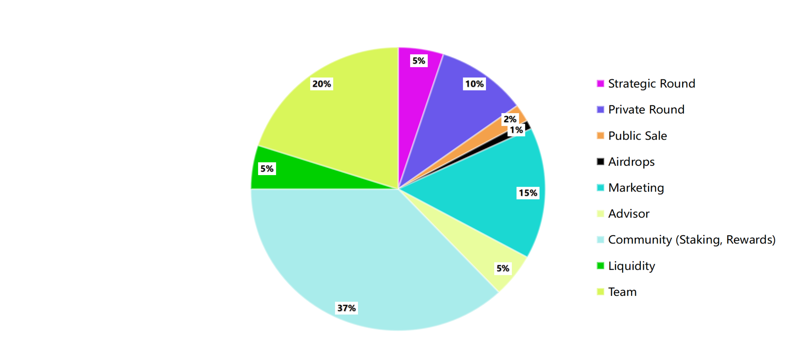
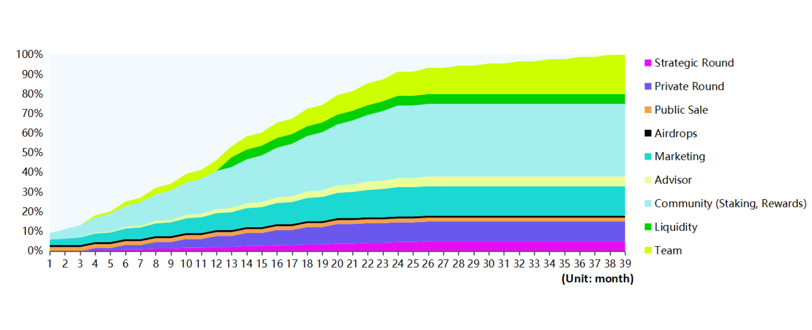

# Tokenomics

### **Tokenomics**

#### **Token Information**

$BRE is the native token of the Boba Brewery framework and plays a central role in our platform. It allows holders to utilize our launchpad, stake their assets and vote on any upcoming governance proposals. The token is also designed to be a utility coin and will be used to encourage holders to adopt the protocol.

Token Name: $BRE&#x20;

Total supply: 1,000,000,000 $BRE (fixed)&#x20;

Strategic sale price: $0.015&#x20;

Private sale price: $0.02&#x20;

Public sale price: $0.04

**Token Allocation**

Both our strategic and private sale rounds are distributed over many different participants. By distributing our strategic, private and public sales, we are trying to create the fairest token distribution on launch with no single entity holding a large quantity of the supply.

For token vesting, we will lock tokens ahead of the public sale. For the sake of transparency, all addresses and vesting seeds will be published on Boba Brewery for people to get an overview.

All of our token holders will receive allocation with following principles:

* Long-term participants are rewarded&#x20;
* Maximum allocations per user to promote broader distribution

**Strategic Round: 5%** – 3 month cliff, then 8.33% released bimonthly for next 24 months

**Private Round: 10%**  – 3 month cliff, then 11.11% released bimonthly for next 18 months

**Public Sale: 2%** – 100% unlocked at TGE

**Airdrops: 1%** – 100% unlocked at TGE

**Marketing: 15%** – 15% unlocked at TGE, then 4.17% released monthly for next 24 months

**Advisor: 5%** – 3 month cliff, then 8.33% released bimonthly for next 24 months

**Community (Staking, Rewards): 37%**  – 5% unlocked, then 4.17% released monthly for next 24 months

**Liquidity: 5%** – 100% locked for 12 months

**Team: 20%** – 3 month cliff, then 5.56% released bimonthly for next 36 months

**Token Utilities**

Native token $BRE is used as the utility tokens in Boba Brewery with multiple functions.

* **Allocation staking:** $BRE is the only token used for allocation staking for all IDO projects.
* **Rewards:** users can always receive rewards by staking $BRE tokens.
* **Access service:** $BRE token is used as the utility token to access all the service provided by Boba Brewery platform and the Community.
* **Governance:** $BRE tokens offer the voting rights in our community and DAO. A user’s vote-weight is based on the amount of $BRE tokens the user has at the time of the vote.

**The Boba Brewery Tiered System**

Boba Brewery launchpad has a five fixed-tier system based on the number of tokens staked.

Tier1:  Staking 0-5,000 $BRE tokens, guaranteed 1x IDO allocation

Tier2:  Staking 5,001-25,000 $BRE tokens, guaranteed 2x IDO allocation

Tier3:  Staking 25,001-50,000 $BRE tokens, guaranteed 3x IDO allocation

Tier4:  Staking 50,001-100,000 $BRE tokens, guaranteed 4x IDO allocation

Tier5:  Staking 100,001-Maximum Allocations $BRE tokens, guaranteed 5x IDO allocation.

Feedbacks from the community are continuously collected to help improve Boba Brewery over time. We would adjust weights, add new tiers, and other enhancements as needed to keep the system functional, competitive, and rewarding. This platform aims to benefit all our token holders, to be fair to all the launches, and to provide opportunities for investors with all the promising projects on the Boba Network.
